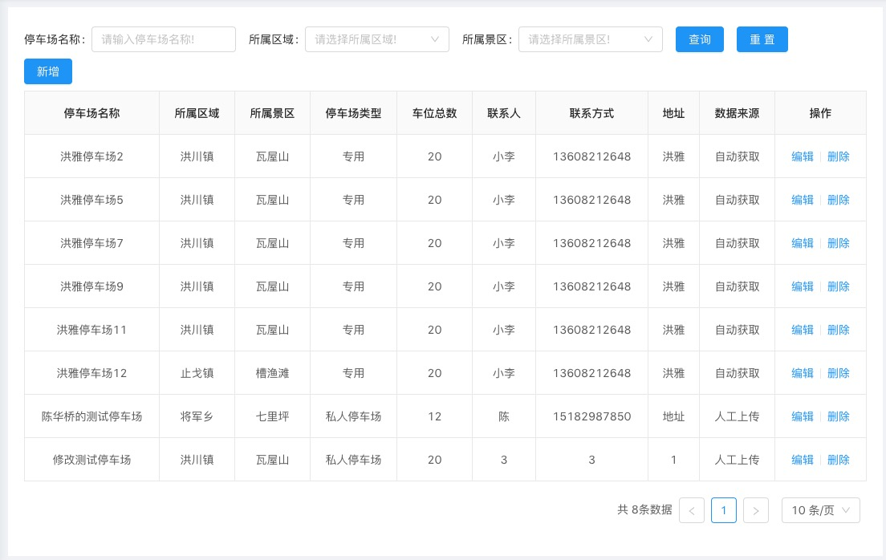
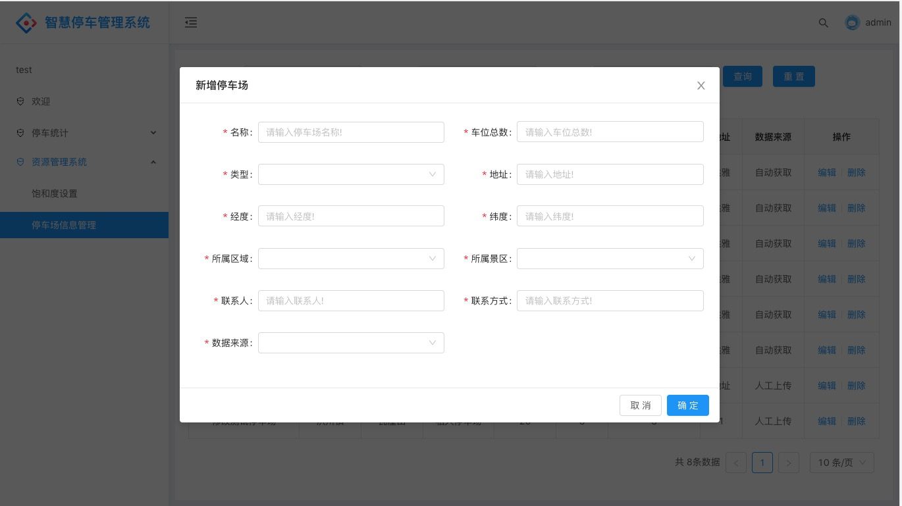
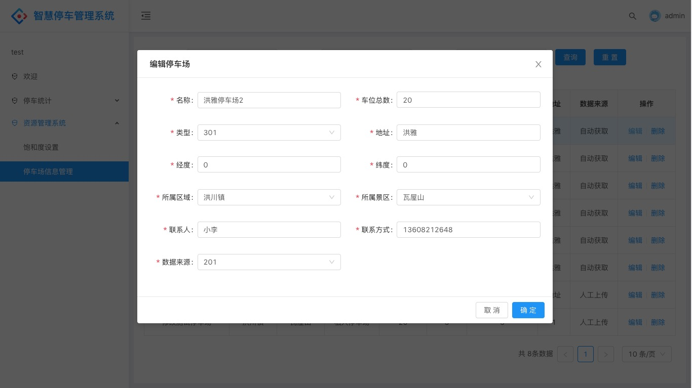
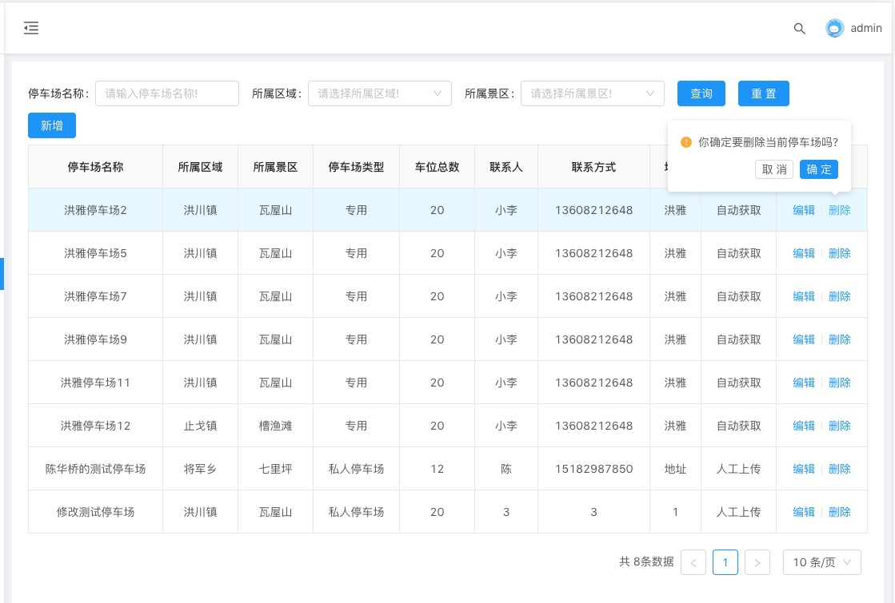

#常规表格的增删改查页面

## 用法

```sh
umi block add https://github.com/qsg1215/sunriseBlockList/tree/master/TabelBlock --path=yourPath
```

将目录下面的Tabel 中的文件拷贝到pages 根目录几面即可
注意修改模块名称和方法名称, 建议批量替换

## 效果图



### 新增页面


### 编辑页面


### 删除页面



